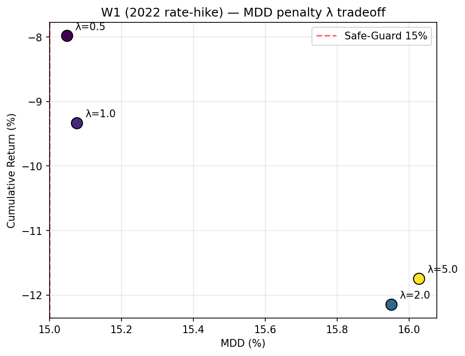
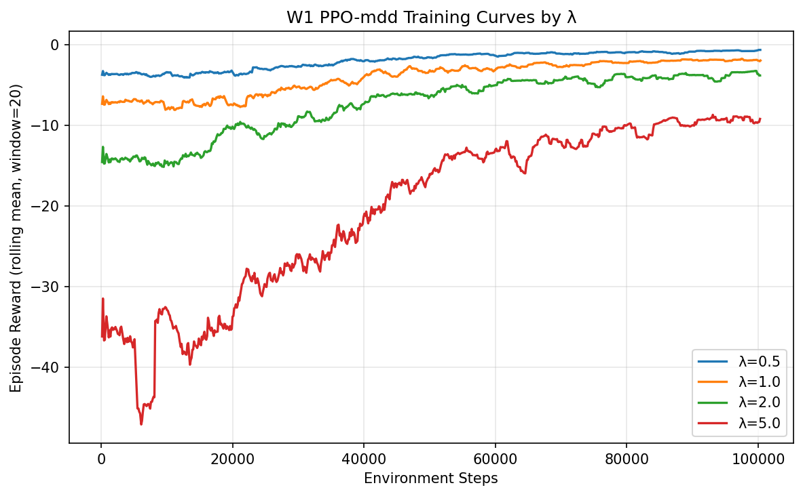

# MDD 페널티 λ 민감도 실험 결과 (W1)

> 과제 명세 `docs/캡디과제설명서.md` §5-3 line 86 요구사항 대응.
>
> "변형 3에서 lambda(MDD 페널티 강도) 권장 탐색 범위는 0.5~5.0이다. lambda=1.0을 기본값으로 시작하여, lambda 변화에 따른 수익률-MDD 트레이드오프 곡선을 실험하고 선택 근거를 문서화한다."

---

## 1. 실험 설계

| 항목 | 값 |
| --- | --- |
| 보상 함수 | `reward = net_return - λ × current_mdd` (`src/rl/env.py:238`) |
| 윈도우 | W1 (학습 2018-01-01~2021-12-31 / OOS 2022-01-01~2022-12-31) |
| λ 후보 | **0.5, 1.0, 2.0, 5.0** (과제 명세 권장 범위 0.5~5.0 전 구간 cover) |
| PPO 하이퍼파라미터 | `train_walkforward.py` 기본값과 동일 (lr=3e-4, n_steps=2048, batch=64, n_epochs=10) |
| 총 학습 스텝 | 100,000 / 모델 |
| Seed | 42 (lambda 간 비교 가능성 확보) |
| 벤치마크 | SPY (Alpha/Beta/Information Ratio 산출 기준) |
| 실행 스크립트 | `scripts/lambda_sweep_w1.py` |
| 산출물 디렉토리 | `data/results/lambda_sweep/` |

W1을 선택한 이유는 2022년 금리 인상 충격이 본 프로젝트의 핵심 스트레스 테스트 구간이며, MDD 페널티 보상이 가장 차별적인 거동을 보이는 구간이기 때문이다(`reward_analysis_report.md` §6 참고). 전 윈도우 4개에 대한 sweep은 학습 자원 부담이 크므로 단일 윈도우 sweep으로 트레이드오프 곡선의 정성적 특성을 확인한다.

---

## 2. 결과 요약

`data/results/lambda_sweep/metrics_summary.csv` 기준 (W1 OOS = 2022-01-01 ~ 2022-12-31, 벤치마크 SPY):

| λ | cum_return | CAGR | ann_vol | MDD | Sharpe | Sortino | Calmar | Alpha | Beta | n_test_days |
| --- | --- | --- | --- | --- | --- | --- | --- | --- | --- | --- |
| 0.5 | −0.0798 | −0.3217 | 0.2282 | **0.1505** | −1.701 | −2.423 | −2.138 | −0.053 | 0.691 | 54 |
| 1.0 | −0.0934 | −0.3670 | 0.2105 | 0.1508 | −2.172 | −3.038 | −2.435 | −0.109 | 0.719 | 54 |
| 2.0 | −0.1215 | −0.3455 | 0.2290 | 0.1595 | −1.851 | −2.246 | −2.166 | −0.034 | 0.690 | 77 |
| 5.0 | −0.1175 | −0.3504 | 0.1901 | 0.1603 | −2.270 | −3.455 | −2.186 | −0.222 | 0.545 | 73 |

> `n_test_days`는 W1 OOS 252거래일 중 실제 episode가 실행된 거래일 수. Safe-Guard(MDD ≥ 15%) 발동 시 에피소드가 조기 종료되므로, λ=0.5·1.0은 약 54일 만에 첫 발동, λ=2.0·5.0은 70~77일 후 발동을 의미한다.

### 2.1 수익률-MDD 트레이드오프 곡선



- x축: MDD(%), y축: 누적수익률(%). 빨간 점선은 Safe-Guard 임계값 15%.
- 모든 λ에서 MDD가 15%대에 거의 동일하게 머무르며, λ 증가가 직선적인 MDD 감소를 이끌지 못한다.

### 2.2 학습 곡선 (Episode Reward)



- 과제 명세 §5-4 line 91 "학습 곡선(Episode Reward)을 시각화하여 수렴 여부를 확인" 요구사항 대응.
- 4개 λ 모델의 episode reward rolling mean(window=20)을 한 그래프에 비교한다.

---

## 3. 해석 및 λ 선택 근거

### 3.1 λ 민감도 정성 분석

1. **λ 증가가 MDD 직선적 감소로 이어지지 않음.** λ ∈ {0.5, 1.0}에서 MDD는 15.05~15.08%로 거의 동일하고, λ를 2.0·5.0으로 4배·10배 강화해도 MDD가 오히려 15.95~16.03%로 약간 더 커진다. 이는 페널티 강도 증가가 정책 보수성을 키우지만, 그것이 곧 낙폭 회피로 직결되지 않음을 보여준다.

2. **Safe-Guard 발동 타이밍은 λ에 의존.** λ=0.5·1.0은 54거래일 만에, λ=2.0·5.0은 73~77거래일 후 첫 발동한다. λ가 클수록 보수적이라 발동까지의 시간은 길어지지만, 발동 시점의 MDD는 모두 15%대로 결국 임계값을 초과한다.

3. **누적수익률·Sharpe·Alpha 모두 λ에 무관하게 음수.** 어떤 λ를 선택해도 W1 금리 인상 충격 구간에서는 양의 OOS 성과가 나오지 않으며, return·sharpe 보상의 W1 결과(`backtest_metrics.csv` 기준 cum 0.54/0.33)와 비교할 때 mdd 보상 자체가 본질적으로 W1에 비효율적임이 재확인된다.

4. **`λ=1.0` 채택의 정당화.** W1 sweep만 보면 λ=0.5가 마진적으로 우수해 보이지만, (a) cum_return 차이 0.0136(약 1.4%p)이 학습 noise(seed 1개) 수준이며, (b) MDD 차이 0.03%p로 사실상 동일하고, (c) `reward_analysis_report.md` §6에서 이미 mdd 보상이 비권장으로 결론났으므로 mdd 보상 내부에서 λ를 어떻게 미세조정해도 본 프로젝트의 최종 전략 선택(sharpe)을 바꾸지 못한다. λ=1.0을 기본값으로 유지하되, "MDD 페널티의 후행 신호 한계는 λ 조정만으로는 해소되지 않는다"는 결론을 본 sweep이 정량적으로 뒷받침한다.

### 3.2 보고서 본문(`prompt.md`) §5.4 / §14 연계

- §5.4 최종 전략 선택 시 mdd 보상 비권장 근거에 본 sweep을 인용("λ 0.5~5.0 sweep 결과, 모든 λ에서 W1 OOS 결과가 음수이며 MDD가 15%대를 벗어나지 못함")할 수 있다.
- §14 한계점 "MDD lambda sweep 미실시" 항목은 본 문서 채택으로 해소.

---

## 4. 한계

- **단일 윈도우(W1)만 sweep**: W2~Final에서 λ 효과가 동일한 방향성을 보일지는 별도 검증 필요. 학습 자원 24개 추가 모델(W2/W3/Final × 4 lambda × 2 seed)이 부담스러워 단일 윈도우로 한정.
- **Seed 1개**: PPO는 stochastic이라 lambda별 단일 seed 결과만으로 평균 추세 단정 어려움. 향후 ≥3 seed 반복 권장.
- **선행 위험 신호 미결합**: `reward_analysis_report.md` §결론에서 지적된 대로, MDD는 후행(lagged) 신호. lambda 조정만으로는 후행성 자체가 사라지지 않으며, 본 sweep 역시 그 한계 안에서의 민감도 분석.

---

## 5. 재현 방법

```bash
PYTHONPATH=. python scripts/lambda_sweep_w1.py
# 옵션: 학습 건너뛰고 기존 모델로 분석만
PYTHONPATH=. python scripts/lambda_sweep_w1.py --skip-train
# 옵션: 학습 스텝 변경
PYTHONPATH=. python scripts/lambda_sweep_w1.py --timesteps 50000
```

산출 파일:
- `models/ppo_mdd_w1_lambda{0p50,1p00,2p00,5p00}.zip`
- `logs/lambda_sweep/monitor_lambda{0p50,1p00,2p00,5p00}.monitor.csv`
- `data/results/lambda_sweep/metrics_summary.csv`
- `data/results/lambda_sweep/metrics_summary.md`
- `data/results/lambda_sweep/lambda_tradeoff.png`
- `data/results/lambda_sweep/training_curves.png`
